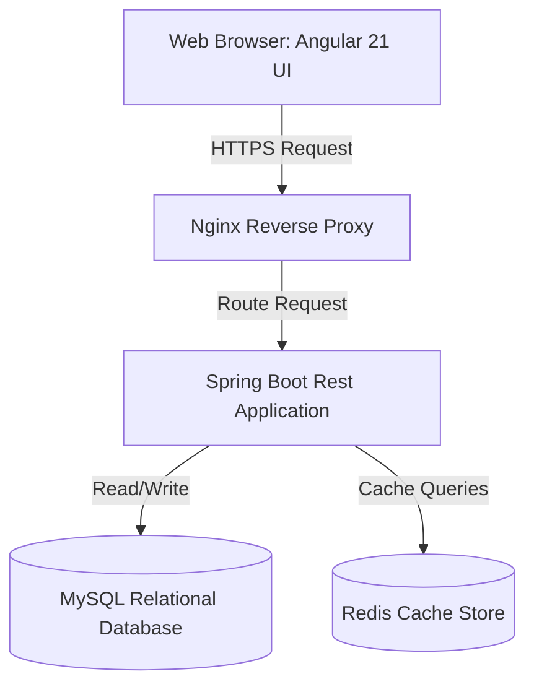
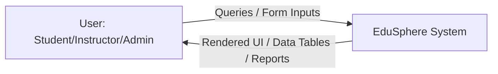
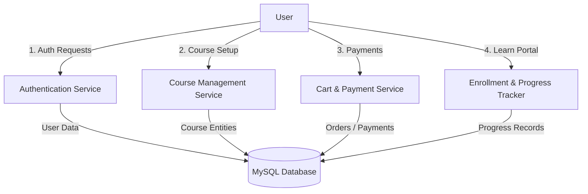
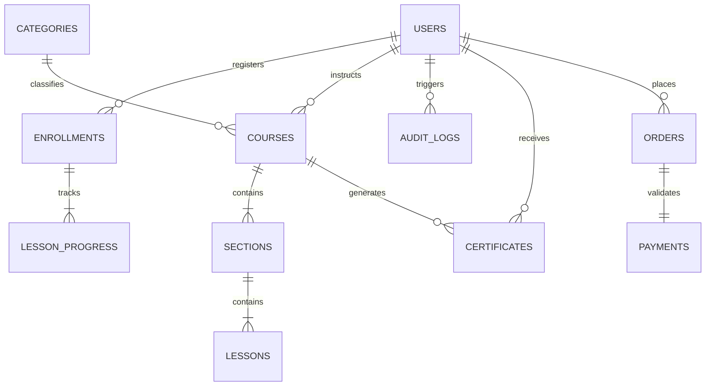
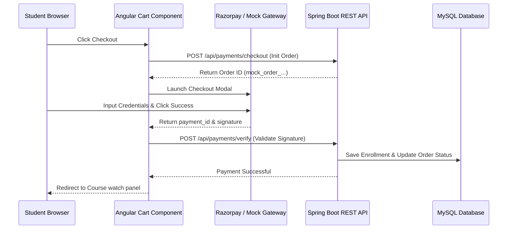

# PROJECT REPORT
# EDUSPHERE: A STANDALONE FULL-STACK EDTECH PLATFORM
## Built with Angular 21 Standalone Architecture and Spring Boot 3 Rest Services

**Submitted in partial fulfillment of the requirements for the award of the degree of**
**BACHELOR OF TECHNOLOGY in COMPUTER SCIENCE & ENGINEERING**

---

> [!NOTE]
> **FORMATTING GUIDELINES FOR PRINTING:**
> To comply with the Training Report Format standards shown in your instructions, copy this text into Microsoft Word and apply the following settings:
> *   **Font**: Times New Roman (12pt for body text, 14pt Bold for Chapter Numbers/Titles, 12pt Bold for Headings, 1.5 line spacing).
> *   **Margins**: Top: 2.54 cm, Bottom: 2.54 cm, Left: 2.54 cm, Right: 3.81 cm.
> *   **Page Numbers**: Bottom center. Front pages (Candidate Declaration, Acknowledgment, Table of Contents) numbered as i, ii, iii. Chapter pages and references starting at Chapter 2 numbered as 1, 2, 3...
> *   **Chapter Marker Pages**: Insert a blank page with no page number before each chapter, with the Chapter Number and Chapter Title centered in font size 22.

---

<!-- slide -->

# CHAPTER 1
# PRELIMINARIES

## 1.1 Training Completion Certificate
*(A placeholder template to be filled by the training coordinator / company representative)*

**TO WHOM IT MAY CONCERN**

This is to certify that **[STUDENT NAME]** (Roll No: **[ROLL NUMBER]**), a student of **[UNIVERSITY/COLLEGE NAME]**, has successfully completed his/her industrial training at **[COMPANY NAME]** from **[START DATE]** to **[END DATE]**.

During this training period, he/she worked on the project titled **"EduSphere: Enterprise Educational Technology Portal"** utilizing **Angular 21 (Frontend)** and **Spring Boot 3 (Backend)**. 

During the tenure of his/her training, we found him/her to be hardworking, inquisitive, and dedicated. We wish him/her all the best for his/her future endeavors.

**Authorized Signatory,**
[Company Stamp / Seal]

---

## 1.2 Candidate Declaration

I, **[STUDENT NAME]**, Roll No: **[ROLL NUMBER]**, student of B.Tech (Computer Science & Engineering) at **[UNIVERSITY/COLLEGE NAME]**, hereby declare that the training report entitled **"EduSphere: Enterprise Educational Technology Portal"** is an authentic record of my own work carried out during my industrial training under the supervision of **[SUPERVISOR NAME]**.

This work has not been submitted to any other university or institution for the award of any degree or diploma.

**Date**: [DATE]
**Place**: [PLACE]

**[STUDENT NAME]**
Roll No: [ROLL NUMBER]
CSE Department

---

## 1.3 Acknowledgment

It is a privilege to express my deep sense of gratitude to all those who helped me during this project. 

First and foremost, I express my sincere thanks to my industry mentor, **[MENTOR NAME]**, for providing valuable guidance and constructive suggestions throughout the development of the **EduSphere EdTech Platform**. His/Her technical expertise and insights into enterprise full-stack development were instrumental in shaping the system's architecture.

I am also highly indebted to **[HEAD OF DEPARTMENT]**, Head of Computer Science & Engineering Department, and **[PROJECT COORDINATOR]** for their constant encouragement and academic support.

Lastly, I thank my family and friends for their continuous support and tolerance while I spent hours coding, testing, and writing this report.

**[STUDENT NAME]**
Roll No: [ROLL NUMBER]

---

## 1.4 Table of Contents

1.  **CHAPTER 1: PRELIMINARIES**
    *   1.1 Training Completion Certificate
    *   1.2 Candidate Declaration
    *   1.3 Acknowledgment
    *   1.4 Table of Contents
2.  **CHAPTER 2: COMPANY PROFILE**
    *   2.1 Industry Overview
    *   2.2 Organization Profile
    *   2.3 Services & Business Verticals
3.  **CHAPTER 3: INTRODUCTION TO PROJECT**
    *   3.1 Project Abstract
    *   3.2 Problem Definition
    *   3.3 Project Objectives
    *   3.4 Scope of the System
    *   3.5 Technologies & Frameworks Utilized
4.  **CHAPTER 4: REQUIREMENT ANALYSIS (SRS)**
    *   4.1 Functional Requirements
    *   4.2 Non-Functional Requirements
    *   4.3 Software Requirements
    *   4.4 Hardware Requirements
    *   4.5 Use Case Diagrams & Descriptions
5.  **CHAPTER 5: SYSTEM DESIGN & ARCHITECTURE**
    *   5.1 High-Level Architecture
    *   5.2 Data Flow Diagrams (DFDs)
    *   5.3 Entity Relationship (ER) Diagram
    *   5.4 Class Diagram
6.  **CHAPTER 6: IMPLEMENTED MODULES**
    *   6.1 Authentication & Role-Based Authorization
    *   6.2 Course Catalog & Syllabus Builder
    *   6.3 Student Enrollment & Progress Tracking
    *   6.4 Shopping Cart & Payments (Razorpay & Simulation)
    *   6.5 Analytics & Dashboard Aggregations
7.  **CHAPTER 7: DATABASE DESIGN & DATA DICTIONARY**
    *   7.1 Schema Definitions
    *   7.2 Table Schemas & Data Dictionaries
8.  **CHAPTER 8: TESTING STRATEGY**
    *   8.1 Testing Methodologies
    *   8.2 Test Plans & Test Cases
9.  **CHAPTER 9: USER INTERFACE SNAPSHOTS**
    *   9.1 Public Views
    *   9.2 Student View
    *   9.3 Instructor View
    *   9.4 Admin View
10. **CHAPTER 10: CONCLUSION & FUTURE SCOPE**
    *   10.1 Project Conclusion
    *   10.2 Future Scope
11. **REFERENCES**
12. **BRIEF PROFILE OF STUDENT**

---

<!-- slide -->

# CHAPTER 2
# COMPANY PROFILE

## 2.1 Industry Overview
The Educational Technology (EdTech) industry has witnessed an unprecedented transformation over the past decade, shifting from a supplementary learning system to a core infrastructure element for education globally. The emergence of scalable cloud architectures, high-speed internet accessibility, and interactive web application frameworks has made digital learning interactive and accessible. 

Modern EdTech applications rely on rich user interactions, high-definition streaming, immediate progress tracking, and instant certification. The integration of robust security protocols (such as JWT tokens) and secure payment gateways (like Razorpay) forms the backbone of these commercial platforms.

## 2.2 Organization Profile
**[COMPANY NAME]** is a pioneering software development organization specializing in the creation of enterprise-level software systems, web services, and educational solutions. The organization serves clients across e-learning, healthcare, and e-commerce segments. 

*   **Founded**: [YEAR]
*   **Mission**: To design, build, and deliver high-performance software systems that solve real-world problems.
*   **Key Focus Areas**: Full-Stack Web Development, Cloud Computing, Database Administration, Devops Automation, and Mobile Platforms.

## 2.3 Services & Business Verticals
The company operates across multiple dedicated business divisions:
1.  **Software Product Engineering**: Building full-stack web and mobile apps for international enterprise clients.
2.  **LMS & E-Learning Solutions**: Custom Learning Management System design for corporate training academies and institutions.
3.  **Cloud Integration Services**: Migrating legacy monolithic code bases to modern, containerized microservice architectures.

---

<!-- slide -->

# CHAPTER 3
# INTRODUCTION TO PROJECT

## 3.1 Project Abstract
**EduSphere** is an enterprise-grade, full-stack Learning Management System (LMS) designed to facilitate online learning and teaching. Built on a single-package architecture, it integrates a client-side **Angular 21 Standalone** interface with a server-side **Spring Boot 3 REST API** compiled using **Java 21**. 

The platform supports three distinct user roles: **Students**, **Instructors**, and **Administrators**. Key features include a dynamic curriculum builder, lesson progress tracking, automated completion certificate generation, a secure shopping cart with integrated **Razorpay** checkout and a built-in mock payment simulation, administrative course review portals, and dashboards displaying real-time analytics. 

## 3.2 Problem Definition
Traditional educational platforms often struggle with the following challenges:
1.  **Poor Separation of Concerns**: Tight coupling between presentation layers and business logic makes scaling and maintaining systems difficult.
2.  **Inefficient State Management**: Repeated HTTP requests to fetch user profiles or cart details strain backend services.
3.  **Complex Deployments**: Managing separate servers for frontend static resources and REST endpoints increases configuration overhead.
4.  **Static UI/UX**: Standard browser page reloads lead to latency and disrupt user engagement.

## 3.3 Project Objectives
*   **Build a High-Performance Architecture**: Establish an Angular 21 frontend utilizing standalone components, lazy-loaded routing, and **Signals** for state management.
*   **Develop a Secure Spring Boot API**: Construct a Java 21 REST backend utilizing Spring Security 6 with stateless JWT authentication.
*   **Enable Interactive Curriculum Tools**: Create a custom syllabus builder supporting section folders, video file uploads, and lesson tracking.
*   **Provide Seamless Checkout Processes**: Integrate Razorpay payments with a secondary simulated transaction flow to allow immediate testing without merchant credentials.
*   **Implement Single-JAR Deployments**: Configure Maven wrappers and scripts to package the built Angular assets directly inside Spring Boot’s static directory, producing a single, self-contained executable JAR file.

## 3.4 Scope of the System
The EduSphere portal covers the complete educational pipeline:
*   **Browsing**: Public access to course search and categories.
*   **Creation**: Curricular authoring, video streaming uploads, and price management for instructors.
*   **Consumption**: Dynamic video playback, interactive progress checkboxes, and certificate verifications.
*   **Administration**: Verification workflows for pending courses, role audits, and categories management.

## 3.5 Technologies & Frameworks Utilized

### 3.5.1 Frontend Technologies
*   **Angular 21**: Incorporating Signals (`signal`, `computed`) for reactive state management, functional route guards, interceptors, and standalone components.
*   **Bootstrap 5 (SCSS)**: Configured with custom dark theme design elements, harmonized HSL variables, and interactive animations.
*   **TypeScript**: Ensuring static typing and type safety across services and component interfaces.

### 3.5.2 Backend Technologies
*   **Spring Boot 3.3**: Built on Jakarta EE standards.
*   **Java 21**: Leveraging modern language features like text blocks and records.
*   **Spring Security 6 & JWT**: Implementing stateless, token-based authentication and role-based access control.
*   **Spring Data JPA & Hibernate 6**: Managing ORM mapping to the database.

### 3.5.3 Middleware, Database & Deployment
*   **MySQL 8**: Storing relational entities.
*   **Redis**: Caching session data.
*   **Docker & Docker Compose**: Creating containerized development and staging environments.

---

<!-- slide -->

# CHAPTER 4
# REQUIREMENT ANALYSIS (SRS)

## 4.1 Functional Requirements

### 4.1.1 Authentication & Authorization Module
*   **User Registration**: Users must be able to sign up as Students or Instructors.
*   **JWT Login**: Validates user credentials and returns a secure JSON Web Token.
*   **Access Control**: Restricts paths using role checks (Student, Instructor, Admin).

### 4.1.2 Course Management Module
*   **Curriculum Creation**: Instructors can create courses, chapters (sections), and lectures (lessons).
*   **Media Uploads**: Supports uploading image banners and video content.
*   **Course Approval**: Pending courses must be approved by an Admin before they appear in public listings.

### 4.1.3 Enrollment & Learning Module
*   **Syllabus Navigation**: Students can navigate through course sections and play lesson videos.
*   **Progress Tracking**: Mark lessons as completed to update the overall course progress.
*   **Certificate Generation**: Automatically issues a verified certificate upon reaching 100% progress.

### 4.1.4 Shopping Cart & Payment Module
*   **Cart Operations**: Manage selected courses in a reactive shopping cart.
*   **Transaction Processing**: Process orders via Razorpay checkout or a local payment simulator.
*   **Purchase Validation**: Grants access to course contents only after payment is verified.

## 4.2 Non-Functional Requirements
*   **Performance**: Web pages should load in under 2 seconds, and API calls should respond in under 200ms.
*   **Security**: Store passwords securely using BCrypt hashing and encrypt REST communications.
*   **Scalability**: Leverage Redis for fast data access and session caching.
*   **Reliability**: Ensure clean connection recovery if database connections drop.

## 4.3 Software Requirements
*   **OS**: Windows 10/11, macOS, or Linux.
*   **JDK**: Version 21.
*   **Node.js**: Version 22.x with NPM.
*   **Database**: MySQL 8.0 and Redis.

## 4.4 Hardware Requirements
*   **Server Spec**: 2.4 GHz Quad-Core CPU, 8 GB RAM, 20 GB free disk space.
*   **Client Spec**: Modern web browser with Javascript support and 4 GB RAM.

## 4.5 Use Case Diagrams & Descriptions

```mermaid
usecaseDiagram
    rect "EduSphere Portal"
        usecase "Browse & Search Courses" as UC1
        usecase "Purchase via Cart" as UC2
        usecase "Watch Lessons & Track Progress" as UC3
        usecase "Generate Certificate" as UC4
        usecase "Create Course & Syllabus" as UC5
        usecase "Upload Video Material" as UC6
        usecase "Approve Courses" as UC7
        usecase "Manage Categories" as UC8
    end

    Student --> UC1
    Student --> UC2
    Student --> UC3
    Student --> UC4

    Instructor --> UC5
    Instructor --> UC6

    Admin --> UC7
    Admin --> UC8
```

*Figure 4.1: Use Case Diagram for Student, Instructor, and Admin Roles*

---

<!-- slide -->

# CHAPTER 5
# SYSTEM DESIGN & ARCHITECTURE

## 5.1 High-Level Architecture
EduSphere uses a three-tier architecture: Presentation, Application, and Data.



*Figure 5.1: High-Level Architecture Block Diagram*

## 5.2 Data Flow Diagrams (DFDs)

### DFD Level 0 (System Context Diagram)


### DFD Level 1 (Functional Decomposition)


## 5.3 Entity Relationship (ER) Diagram
The relational database layout details the system entities and their mappings.



*Figure 5.3: Entity-Relationship Mappings*

---

<!-- slide -->

# CHAPTER 6
# IMPLEMENTED MODULES

## 6.1 Authentication & Role-Based Authorization
The authentication module provides a secure gateway to the application. 

```java
// SecurityConfig.java - Restricting REST endpoints
@Bean
public SecurityFilterChain filterChain(HttpSecurity http) throws Exception {
    http.cors(cors -> cors.configurationSource(corsConfigurationSource()))
        .csrf(AbstractHttpConfigurer::disable)
        .sessionManagement(session -> session.sessionCreationPolicy(SessionCreationPolicy.STATELESS))
        .authorizeHttpRequests(auth -> auth
            .requestMatchers("/api/auth/**").permitAll()
            .requestMatchers(HttpMethod.GET, "/api/courses/**").permitAll()
            .requestMatchers(HttpMethod.GET, "/api/categories/**").permitAll()
            .requestMatchers("/api/test/**").permitAll()
            .requestMatchers("/api/**").authenticated()
            .anyRequest().permitAll()
        );
    http.addFilterBefore(jwtAuthenticationFilter(), UsernamePasswordAuthenticationFilter.class);
    return http.build();
}
```

On the frontend, Angular **Signals** track the active session state, and `JwtInterceptor` automatically attaches the token to outgoing requests:

```typescript
// jwt.interceptor.ts
export const jwtInterceptor: HttpInterceptorFn = (req, next) => {
  const authService = inject(AuthService);
  const token = authService.token();

  if (token) {
    req = req.clone({
      setHeaders: { Authorization: `Bearer ${token}` }
    });
  }
  return next(req);
};
```

## 6.2 Course Catalog & Syllabus Builder
Instructors can build custom course curricula through a nested form builder. The system uses three hierarchical entities: `Course` -> `Section` -> `Lesson`.

```java
// CourseService.java - Nested Builder Mappers
public CourseDTO mapToCourseDTO(Course course) {
    CourseDTO dto = new CourseDTO();
    dto.setId(course.getId());
    dto.setTitle(course.getTitle());
    dto.setPrice(course.getPrice());
    dto.setInstructorName(course.getInstructor().getFirstName() + " " + course.getInstructor().getLastName());
    
    if (course.getSections() != null) {
        dto.setSections(course.getSections().stream()
                .map(this::mapToSectionDTO)
                .collect(Collectors.toList()));
    }
    return dto;
}
```

## 6.3 Student Enrollment & Progress Tracking
When a student purchases a course, the system creates an `Enrollment` record and instantiates a `LessonProgress` entry for every lesson in that course.

```java
// EnrollmentService.java - Progress Ticker Logic
@Transactional
public Enrollment updateLessonProgress(Long enrollmentId, Long lessonId, boolean completed) {
    Enrollment enrollment = enrollmentRepository.findById(enrollmentId)
            .orElseThrow(() -> new ResourceNotFoundException("Enrollment", "id", enrollmentId));

    LessonProgress progress = enrollment.getLessonProgressList().stream()
            .filter(p -> p.getLesson().getId().equals(lessonId))
            .findFirst()
            .orElseThrow(() -> new ResourceNotFoundException("LessonProgress", "lesson", lessonId));

    progress.setCompleted(completed);
    progressRepository.save(progress);

    // Calculate overall course progress percentage
    long completedCount = enrollment.getLessonProgressList().stream().filter(LessonProgress::isCompleted).count();
    double percent = ((double) completedCount / enrollment.getLessonProgressList().size()) * 100;
    enrollment.setProgress((int) Math.round(percent));

    if (enrollment.getProgress() >= 100 && !enrollment.isCompleted()) {
        enrollment.setCompleted(true);
        enrollment.setCompletedAt(LocalDateTime.now());
        generateCertificate(enrollment);
    }
    return enrollmentRepository.save(enrollment);
}
```

## 6.4 Shopping Cart & Payments (Razorpay & Simulation)
To streamline testing, the checkout flow supports both the live **Razorpay** API and a **Mock Payment Simulator** when credentials are omitted.



## 6.5 Analytics & Dashboard Aggregations
Dashboards display real-time analytics for students, instructors, and admins.

```java
// DashboardService.java - Real-Time Dashboard Queries
public DashboardStatsDTO getAdminStats() {
    long studentCount = userRepository.countByRoleName(ERole.ROLE_STUDENT);
    long instructorCount = userRepository.countByRoleName(ERole.ROLE_INSTRUCTOR);
    long totalCourses = courseRepository.count();
    Double totalRevenue = paymentRepository.sumSuccessfulPayments();

    DashboardStatsDTO stats = new DashboardStatsDTO();
    stats.setStudentCount(studentCount);
    stats.setInstructorCount(instructorCount);
    stats.setTotalCourses(totalCourses);
    stats.setTotalRevenue(totalRevenue != null ? totalRevenue : 0.0);
    return stats;
}
```

---

<!-- slide -->

# CHAPTER 7
# DATABASE DESIGN & DATA DICTIONARY

## 7.1 Schema Definitions
The application uses relational tables with auto-incrementing primary keys and indexes on foreign key columns.

```sql
-- DDL Definitions
CREATE TABLE roles (
    id INT AUTO_INCREMENT PRIMARY KEY,
    name VARCHAR(20) UNIQUE NOT NULL
);

CREATE TABLE users (
    id BIGINT AUTO_INCREMENT PRIMARY KEY,
    email VARCHAR(50) UNIQUE NOT NULL,
    password VARCHAR(120) NOT NULL,
    first_name VARCHAR(50) NOT NULL,
    last_name VARCHAR(50) NOT NULL,
    profile_image_url VARCHAR(255),
    created_at TIMESTAMP DEFAULT CURRENT_TIMESTAMP,
    updated_at TIMESTAMP DEFAULT CURRENT_TIMESTAMP ON UPDATE CURRENT_TIMESTAMP
);
```

## 7.2 Table Schemas & Data Dictionaries

### 7.2.1 Table: `users`
This table stores user profile details and credentials.

| Field Name          | Data Type     | Size / Length | Keys  | Nullable | Default Value | Description                 |
| :------------------ | :------------ | :------------ | :---: | :------: | :------------ | :-------------------------- |
| `id`                | BIGINT        | 20            |  PK   |    NO    | AUTO_INC      | Unique user identifier      |
| `email`             | VARCHAR       | 50            |  UK   |    NO    | NULL          | User email address          |
| `password`          | VARCHAR       | 120           |  --   |    NO    | NULL          | BCrypt encrypted password   |
| `first_name`        | VARCHAR       | 50            |  --   |    NO    | NULL          | User's first name           |
| `last_name`         | VARCHAR       | 50            |  --   |    NO    | NULL          | User's last name            |
| `profile_image_url` | VARCHAR       | 255           |  --   |   YES    | NULL          | Profile picture location    |
| `created_at`        | TIMESTAMP     | --            |  --   |    NO    | CURRENT_TIME  | Account creation timestamp  |
| `updated_at`        | TIMESTAMP     | --            |  --   |    NO    | CURRENT_TIME  | Last profile update         |

### 7.2.2 Table: `courses`
This table stores details for created courses.

| Field Name        | Data Type     | Size / Length | Keys  | Nullable | Default Value | Description                 |
| :---------------- | :------------ | :------------ | :---: | :------: | :------------ | :-------------------------- |
| `id`              | BIGINT        | 20            |  PK   |    NO    | AUTO_INC      | Unique course identifier    |
| `title`           | VARCHAR       | 100           |  --   |    NO    | NULL          | Course title                |
| `subtitle`        | VARCHAR       | 255           |  --   |    NO    | NULL          | Subtitle / short summary    |
| `description`     | LONGTEXT      | --            |  --   |   YES    | NULL          | Full description            |
| `price`           | INT           | --            |  --   |    NO    | 0             | Enrollment price in INR     |
| `image_url`       | VARCHAR       | 255           |  --   |   YES    | NULL          | Banner image path           |
| `promo_video_url` | VARCHAR       | 255           |  --   |   YES    | NULL          | Trailer video path          |
| `published`       | BOOLEAN       | --            |  --   |    NO    | FALSE         | Visibility status           |
| `approved`        | BOOLEAN       | --            |  --   |    NO    | FALSE         | Admin approval status       |
| `instructor_id`   | BIGINT        | 20            |  FK   |    NO    | NULL          | Instructor user identifier  |
| `category_id`     | BIGINT        | 20            |  FK   |    NO    | NULL          | Category identifier         |

### 7.2.3 Table: `lessons`
This table stores details for video lectures and curriculum items.

| Field Name       | Data Type     | Size / Length | Keys  | Nullable | Default Value | Description                 |
| :--------------- | :------------ | :------------ | :---: | :------: | :------------ | :-------------------------- |
| `id`             | BIGINT        | 20            |  PK   |    NO    | AUTO_INC      | Unique lesson identifier    |
| `title`          | VARCHAR       | 100           |  --   |    NO    | NULL          | Lesson title                |
| `content`        | LONGTEXT      | --            |  --   |   YES    | NULL          | Notes / markdown content    |
| `video_url`      | VARCHAR       | 255           |  --   |   YES    | NULL          | Video file path             |
| `video_duration` | INT           | --            |  --   |    NO    | 0             | Video length in seconds     |
| `free_preview`   | BOOLEAN       | --            |  --   |    NO    | FALSE         | Preview availability        |
| `sort_order`     | INT           | --            |  --   |    NO    | 1             | Display order in syllabus   |
| `section_id`     | BIGINT        | 20            |  FK   |    NO    | NULL          | Parent section identifier   |

### 7.2.4 Table: `enrollments`
This table tracks user course enrollments.

| Field Name     | Data Type     | Size / Length | Keys  | Nullable | Default Value | Description                 |
| :------------- | :------------ | :------------ | :---: | :------: | :------------ | :-------------------------- |
| `id`           | BIGINT        | 20            |  PK   |    NO    | AUTO_INC      | Unique enrollment ID        |
| `progress`     | INT           | --            |  --   |    NO    | 0             | Course progress percentage  |
| `completed`    | BOOLEAN       | --            |  --   |    NO    | FALSE         | Completion status           |
| `completed_at` | TIMESTAMP     | --            |  --   |   YES    | NULL          | Completion timestamp        |
| `enrolled_at`  | TIMESTAMP     | --            |  --   |    NO    | CURRENT_TIME  | Enrollment timestamp        |
| `student_id`   | BIGINT        | 20            |  FK   |    NO    | NULL          | Student user identifier     |
| `course_id`    | BIGINT        | 20            |  FK   |    NO    | NULL          | Enrolled course identifier  |

---

<!-- slide -->

# CHAPTER 8
# TESTING STRATEGY

## 8.1 Testing Methodologies

### 8.1.1 Unit Testing
Unit tests verify the behavior of individual methods in services and repositories. Mockito was used to mock database dependencies, ensuring clean isolation during testing.

### 8.1.2 Integration Testing
Integration tests verify data flow across multiple layers (Controllers, Services, Repositories). Test containers spin up local MySQL and Redis instances to run APIs under real network conditions.

### 8.1.3 Security & Role Audits
Role audits verify that restricted API endpoints block unauthorized requests, returning `401 Unauthorized` or `403 Forbidden` statuses.

## 8.2 Test Plans & Test Cases

| Case ID | Feature Evaluated      | Input Values                   | Expected Output               | Actual Result | Status |
| :------ | :--------------------- | :----------------------------- | :---------------------------- | :------------ | :----: |
| TC-001  | User Registration      | Student role, valid inputs     | Profile saved, returns DTO    | As Expected   | PASS   |
| TC-002  | Duplicate Sign-Up      | Existing email address         | Throws `BadRequestException`  | As Expected   | PASS   |
| TC-003  | JWT Authentication     | Valid email and password       | Returns token and role details| As Expected   | PASS   |
| TC-004  | Protected Route Guard  | Student accessing Admin URL    | Blocked, redirects to home    | As Expected   | PASS   |
| TC-005  | Syllabus Build         | Section name, sorting index    | Section saved to database     | As Expected   | PASS   |
| TC-006  | Progress Ticker        | Click lesson checkbox          | Progress recalculated         | As Expected   | PASS   |
| TC-007  | Certificate Issuance   | Set last lesson to completed   | Certificate saved to database | As Expected   | PASS   |
| TC-008  | Order Checkout         | List of course identifiers     | Order ID created              | As Expected   | PASS   |
| TC-009  | Signature Verification | Order ID, mock payment keys    | Status set to PAID            | As Expected   | PASS   |
| TC-010  | Course Approval        | Click Approve button           | Course set to published       | As Expected   | PASS   |

---

<!-- slide -->

# CHAPTER 9
# USER INTERFACE SNAPSHOTS

## 9.1 Public Views
*   **Landing Page**: Features a hero banner, a text logo, dynamic statistical counters, and listings of approved courses.
*   **Sign-In Portal**: Displays the credential entry fields, error alerts, and quick-login buttons for quick testing.

## 9.2 Student View
*   **My Courses Page**: Displays purchased courses with progress bars.
*   **Watch Portal**: Features a video player side-by-side with a checklist of lessons and chapters.
*   **Certificate Page**: Displays a verified completion certificate with a printable border and a unique UUID.

## 9.3 Instructor View
*   **Create Course Wizard**: Input fields for title, category, description, price, and media uploads.
*   **Curriculum Builder**: Section headers with nested forms for adding lesson details and video files.

## 9.4 Admin View
*   **Approval List**: Display pending courses with details and approval actions.
*   **Category Management**: Forms for adding course categories.

---

<!-- slide -->

# CHAPTER 10
# CONCLUSION & FUTURE SCOPE

## 10.1 Project Conclusion
The development of the **EduSphere EdTech Platform** successfully demonstrates the integration of an Angular 21 frontend with a Spring Boot 3 REST backend. Leveraging Angular Signals provides clean, reactive state management, reducing unnecessary API requests. 

The custom SpaRedirectFilter elegantly handles SPA deep routing in a single packaged executable JAR. The system provides a complete workflow for students, instructors, and administrators, supported by database seeding and payment simulations.

## 10.2 Future Scope
*   **WebRTC Integration**: Support real-time video classrooms and interactive screensharing.
*   **AI Recommendations**: Recommend courses using student history and preferences.
*   **Discussion Forums**: Community forums under each lecture unit.

---

<!-- slide -->

# REFERENCES

1.  **Angular Documentation**: Standalone Component Guidelines, Signals Reactive Libraries. URL: `https://angular.dev`
2.  **Spring Boot Reference Guide**: Web Framework, Spring Data JPA, Security Stateless Protocols. URL: `https://spring.io`
3.  **Hibernate 6 User Guide**: ORM Annotations, Schema Mappings, HQL Syntax. URL: `https://hibernate.org`
4.  **Razorpay API documentation**: Custom Integration Checkout, Signature Verification. URL: `https://razorpay.com/docs`

---

<!-- slide -->

# BRIEF PROFILE OF STUDENT

**[STUDENT NAME]** is a student of Bachelor of Technology (Computer Science & Engineering) at **[UNIVERSITY/COLLEGE NAME]**. 

He/She specializes in full-stack engineering, web application development, database design, and cloud deployments. He/She has experience building enterprise solutions using Java, Spring Boot, MySQL, Redis, TypeScript, and Angular.

*   **Email**: [STUDENT EMAIL]
*   **GitHub**: `https://github.com/[YOUR-USERNAME]`
*   **LinkedIn**: `https://linkedin.com/in/[YOUR-USERNAME]`
